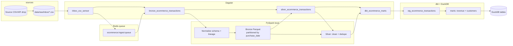

# E-commerce data processing and orchestration

Batch pipeline: **Dagster** orchestration, **PySpark** for scalable CSV → Parquet processing (outside the database), **dbt** + **DuckDB** for declarative gold-layer marts and tests.

## Architecture



## Dataset

The raw CSV is not stored in this repository. Please download it from Kaggle, save it as:

`data/raw/ecommerce_customer_data_custom_ratios.csv`


Source: [https://www.kaggle.com/datasets/shriyashjagtap/e-commerce-customer-for-behavior-analysis](https://www.kaggle.com/datasets/shriyashjagtap/e-commerce-customer-for-behavior-analysis)

To test trigger-based ingest, drop additional CSV files into:

`data/raw/inbox/`

## Idempotency and data safety

- **No wholesale `DROP` of datasets.** Spark writes use **dynamic partition overwrite** (`partitionOverwriteMode=dynamic`) on `purchase_date`, so re-running over the same logical batch refreshes only the partitions present in the current DataFrame—other date partitions are left intact.
- **Run lineage:** bronze rows carry `ingest_run_id` and `ingest_batch_id` (plus `source_file_name`).
- **Silver dedupe:** rows are deduplicated on `(customer_id, purchase_ts, product_category, total_purchase_amount)` keeping the latest `ingest_batch_id`.

## Prerequisites

- Docker

## Quick start

Download the CSV into `data/raw/ecommerce_customer_data_custom_ratios.csv`, then run from the repository root:

```bash
docker compose build
docker compose run --rm pipeline
```

## Queue + trigger flow (checkpoint)

- **Queue system:** Redis list `ecommerce:ingest:queue`.
- **Automatic read/inject trigger:** Dagster sensor `inbox_csv_sensor` watches `data/raw/inbox/*.csv`, enqueues new files, and triggers `ecommerce_pipeline_job`.
- **Consumer:** `bronze_ecommerce_transactions` dequeues one event and reads the queued file path; if queue is empty it falls back to `ECOMMERCE_RAW_CSV_PATH`.

Run trigger mode locally:

```bash
docker compose up -d redis
dagster dev -m ecommerce_pipeline.definitions
```

Then copy a CSV into `data/raw/inbox/` and the sensor will start a run automatically.

Outputs:

- Parquet: `data/processed/bronze/...`, `data/processed/silver/...` (mounted on the host).
- dbt: `dbt/target/` on the host (DuckDB file `dbt/target/pipeline.duckdb`, volume-mounted from the container).

Environment (see `.env.example`):

| Variable | Purpose |
|----------|---------|
| `ECOMMERCE_RAW_CSV_PATH` | Path to input CSV (compose sets `/data/raw/...`) |
| `ECOMMERCE_RAW_INBOX_DIR` | Directory watched by the Dagster sensor (`/data/raw/inbox`) |
| `ECOMMERCE_REDIS_HOST` / `ECOMMERCE_REDIS_PORT` | Redis connection for ingest queue |
| `ECOMMERCE_INGEST_QUEUE` | Queue key name (default `ecommerce:ingest:queue`) |
| `ECOMMERCE_PROCESSED_ROOT` | Root for Parquet trees (compose sets `/data/processed`) |
| `PIPELINE_RUN_ID` | Optional stable id logged in bronze |


## Repository layout

| Path | Role |
|------|------|
| `ecommerce_pipeline/` | Dagster definitions, Spark jobs, config |
| `dbt/` | dbt project (staging + marts), DuckDB profile |
| `data/raw/` | Put downloaded CSV here (see [Dataset](#dataset); `*.csv` gitignored) |
| `data/raw/inbox/` | Folder watched by trigger sensor (new CSVs are queued and auto-processed) |
| `data/processed/` | Generated Parquet (gitignored—recreate with the pipeline) |
| `run_pipeline.py` | Assignment single entry point |
| `architecture.mmd` | Mermaid source for the diagram |
