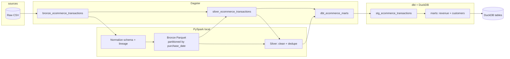

# E-commerce data processing and orchestration

Batch pipeline for the course assignment: **Dagster** orchestration, **PySpark** for scalable CSV → Parquet processing (outside the database), **dbt** + **DuckDB** for declarative gold-layer marts and tests.

## Architecture



The same diagram source lives in [`docs/architecture.mmd`](docs/architecture.mmd) for editors that render Mermaid.

## Idempotency and data safety

- **No wholesale `DROP` of datasets.** Spark writes use **dynamic partition overwrite** (`partitionOverwriteMode=dynamic`) on `purchase_date`, so re-running over the same logical batch refreshes only the partitions present in the current DataFrame—other date partitions are left intact.
- **Run lineage:** bronze rows carry `ingest_run_id` and `ingest_batch_id` (plus `source_file_name`).
- **Silver dedupe:** rows are deduplicated on `(customer_id, purchase_ts, product_category, total_purchase_amount)` keeping the latest `ingest_batch_id`.

## Prerequisites

- **Recommended:** Docker (see below)—includes **Java 17**, which Spark 3.5 expects.
- **Local (no Docker):**
  - **Python 3.10–3.12** (Spark 3.5 + Py4J are problematic on **Python 3.14** in many setups).
  - **JDK 17** (Temurin or OpenJDK). Spark 3.5 + Hadoop **fail on JDK 24+** with `Subject.getSubject` / UGI errors. On macOS:

    ```bash
    brew install openjdk@17
    export JAVA_HOME="$(/usr/libexec/java_home -v 17)"
    ```

## Quick start (Docker)

From the repository root:

```bash
docker compose build
docker compose run --rm pipeline
```

Outputs:

- Parquet: `data/processed/bronze/...`, `data/processed/silver/...` (mounted on the host).
- dbt artifacts: inside the container under `dbt/target/` (add a volume in `docker-compose.yml` if you need the DuckDB file on the host).

Environment (see `.env.example`):

| Variable | Purpose |
|----------|---------|
| `ECOMMERCE_RAW_CSV_PATH` | Path to input CSV (compose sets `/data/raw/...`) |
| `ECOMMERCE_PROCESSED_ROOT` | Root for Parquet trees (compose sets `/data/processed`) |
| `PIPELINE_RUN_ID` | Optional stable id logged in bronze |

## Quick start (venv)

```bash
python3.11 -m venv .venv
source .venv/bin/activate   # Windows: .venv\Scripts\activate
pip install -r requirements.txt
pip install -e .
export JAVA_HOME=...        # JDK 17, see above
python run_pipeline.py
```

### Single entry point

- **CLI:** `python run_pipeline.py` (optional: `--run-id`, `--skip-dbt`).
- **Notebook:** [`notebooks/pipeline.ipynb`](notebooks/pipeline.ipynb) calls the same script.
- **Dagster UI:** `dagster dev -m ecommerce_pipeline.definitions` then open the local URL and materialize assets or run job `ecommerce_pipeline_job`.

## Repository layout

| Path | Role |
|------|------|
| `ecommerce_pipeline/` | Dagster definitions, Spark jobs, config |
| `dbt/` | dbt project (staging + marts), DuckDB profile |
| `docs/architecture.mmd` | Mermaid source for the diagram |
| `data/processed/` | Generated Parquet (gitignored—recreate with the pipeline) |
| `run_pipeline.py` | Assignment single entry point |

## Assignment checklist

- [x] Orchestrated pipeline (**Dagster** assets + job).
- [x] Runnable **PySpark** processing (CSV → partitioned Parquet) with one entry point.
- [x] Architecture diagram in Git (README Mermaid + `docs/architecture.mmd`).
- [x] **dbt** models + tests (bonus).
- [x] Idempotent partition writes; meaningful env vars and structure for handover.

## License

Educational / assignment use.
